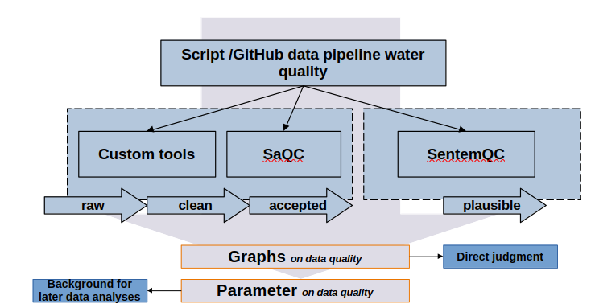

# UFZ Water QC Pipeline

High-signal water-quality time-series cleaning with SaQC integration (version-safe) and robust fallbacks.  
Raw data is never discarded: outputs include `__raw`, `__clean`, and `__accepted`.

---





## Overview

This repository contains two main modules:

- `scripts/ufz_water_qc_pipeline.py` — a full QC pipeline that:
  - normalizes timestamps, resolves duplicates, classifies gaps,
  - detects sentinel values (e.g., `-9`, `-9999`),
  - detects binary switch artefacts (0-runs),
  - detects flat values and flat slopes,
  - checks decimals and quantization,
  - computes seasonal coverage summaries,
  - integrates **SaQC** if present, else uses robust **fallbacks**,
  - optionally applies a **WRTDS-proxy** anomaly finder,
  - generates plots, tables, processed parquet outputs.

- `scripts/sentemqc.py` — a Sentem-style QC helper providing QC bands and masking for O₂, pH, Turbidity, NO₃.

---

## Features

- **Timestamp handling**
  - Sorting, duplicate resolution (median by default).
  - Gap classification (default: >2h → NaN).

- **Sentinel values**
  - Auto-detects frequent sentinel codes and replaces with NaN.

- **Binary switches**
  - Detects value→0→value sequences; logs events with pre/post values.

- **Flat values & slopes**
  - Flags ≥2h runs of constant values or nearly-zero slope.

- **Decimals & quantization**
  - Fractional-part histogram (χ² if SciPy).
  - Dominant double-decimals.
  - Quantization step estimator.

- **Seasonal coverage**
  - Coverage % and NaN % per DJF/MAM/JJA/SON.

- **Plots per variable**
  - Raw, cleaned, decimal hist, successive |Δ|, flat events, Gaussian compare, seasonal coverage heatmap, accepted mask, WRTDS residuals.

- **SaQC integration**
  - Uses SaQC if installed, safe fallbacks otherwise.
  - Lowercase windows (`'2h'`) avoid deprecation warnings.

- **SentemQC**
  - Configurable QC bands for key parameters.

- **WRTDS-proxy**
  - Local regression on time/season (+ discharge).
  - Residual anomalies flagged using robust z.

- **Outputs**
  - Processed Parquet, event tables, seasonal tables, meta, figures.

---

## Repository layout

```
.
├── README.md
├── scripts/
│   ├── ufz_water_qc_pipeline.py
│   └── sentemqc.py
├── data/
│   └── Erkenruh_Einruhr.csv   # example input (not included)
├── water_qc_output/           # created on first run
│   ├── processed/
│   └── reports/
│       ├── figures/
│       └── tables/
├── environment.yml
└── .gitignore
```

---

## Install

### Conda

```bash
conda env create -f environment.yml
conda activate ufz-water-qc
```

### pip

```bash
python -m venv .venv
source .venv/bin/activate        # Windows: .venv\Scripts\activate
pip install --upgrade pip
pip install numpy pandas matplotlib pyarrow
pip install scipy                # optional
pip install saqc                 # optional
```

---

## Quickstart

1. Put your CSV in `./data/Erkenruh_Einruhr.csv`.
2. Edit the **MAIN** section in `scripts/ufz_water_qc_pipeline.py`:
   - `csv_path`, `station_string`, `columns`, `range_map`, `base_out`.
3. Run:

```bash
python scripts/ufz_water_qc_pipeline.py
```

Outputs are created under `water_qc_output/`.

---

## Input format

- CSV with a `timestamp` column.
- Optional `station_field` + `station_string`.
- Variable columns must match your chosen list.

Example:

```text
timestamp,SurfaceWaterConcentration_O2 [mg*L-1],SurfaceWaterpH [pH],SurfaceWaterTurbidity [NTU]
2024-01-01T00:00:00,11.2,8.1,2.3
2024-01-01T00:15:00,11.5,8.1,2.1
...
```

---

## Outputs

**Processed timeseries**  
`water_qc_output/processed/<station>/<station>__qc_timeseries.parquet`

Columns include:
- `__raw`, `__clean`, `__accepted`
- SaQC: `__saqc_flag` (if available)
- Sentem: `__sm_masked`, `__sm_flagged`, `__sm_flagreason`

**Tables**  
`water_qc_output/reports/tables/<station>/`
- `<var>__events.csv`
- `<var>__seasonal_summary.csv`
- `<station>__meta.csv`
- `<station>__seasonal_all.csv`
- `<station>__events_all.csv`

**Figures**  
`water_qc_output/reports/figures/<station>/<var>/`
- `__00_raw.png`
- `__01_clean.png`
- `__02_decimal_hist.png`
- `__03_quant_diffs.png`
- `__04_flat_events.png`
- `__05_gaussian_compare.png`
- `__06_seasonal_coverage.png`
- `__07_wrtds_buster.png`
- `__08_accepted.png`

---

## Quality checks

- **Sentinels** → masked
- **Duplicates** → resolved (median)
- **Gaps >2h** → NaN
- **Binary switches** → events
- **Flat values/slopes** → events
- **Decimals/quantization** → hist + estimator
- **Seasonal coverage** → coverage % per season
- **Gaussian compare** → trend vs residual (SciPy)
- **SaQC block** → see below
- **WRTDS-proxy** → residual spikes

---

## SaQC integration (version-safe)

All calls are checked; fallbacks run if missing.  
Windows use lowercase (`'2h'`, `'6h'`, etc.).

| Check        | SaQC method      | Fallback                                   |
|--------------|------------------|---------------------------------------------|
| Range        | `flagRange`      | numeric mask (`<min` or `>max`)             |
| Missing      | `flagMissing`    | `Series.isna()`                             |
| Constants    | `flagConstants`  | flat-run detector                           |
| Plateau      | `flagPlateau`    | flat values ≥ duration                      |
| Variance     | `flagByVariance` | rolling variance threshold                  |
| Z-score      | `flagZScore`     | rolling median/MAD robust z                 |
| Jumps        | `flagJumps`      | first-difference threshold                  |
| Isolated     | `flagIsolated`   | short finite runs between gaps              |
| UniLOF       | `flagUniLOF`     | robust z fallback                           |

---

## WRTDS-proxy anomalies

Weighted local regression on `[time, sin(2π·doy), cos(2π·doy)]` (+ discharge if present).  
Residual anomalies flagged at `|z| ≥ 4`.  
Plots: residuals vs raw + anomalies.

---

## Configuration

Main parameters:

- `gap_hours=2.0`
- `flat_hours=2.0`
- `flat_slope_win=25`
- `flat_slope_abs=0.0`
- `dec_bins=10`
- `gauss_sigma_hours=6.0`
- `apply_saqc=True`
- `apply_sentem=True`
- `wrtds_q_col=None`

---

## Troubleshooting

- **SaQC not installed** → fallbacks used.
- **Deprecation `'H'` warnings** → lowercase windows are used, update SaQC if needed.
- **Missing parquet writer** → install `pyarrow` or `fastparquet`.
- **SciPy missing** → gaussian compare + χ² skipped.

---

## License

Add your license (MIT recommended):

```
SPDX-License-Identifier: MIT
```

---

## Appendix A — environment.yml

```yaml
name: ufz-water-qc
channels:
  - conda-forge
dependencies:
  - python=3.10
  - numpy
  - pandas
  - matplotlib
  - pyarrow
  - scipy
  - pip
  - pip:
      - saqc
```

---
## Citation

If this pipeline assists academic work, please cite:

- **SaQC**:  
  Grigoryev, S., et al. (2023). *SaQC: Streamflow and Water Quality Data Quality Control Framework*. Zenodo.  
  [https://github.com/SaQC/SaQC](https://github.com/SaQC/SaQC)

- **SentemQC** (Sentem-style QC adaptation):  
  Bieroza, M., et al. (2022). *SentemQC: Flexible Quality Control for High-Frequency Water Quality Data*. Open Research Europe, 4:244.  
  [https://open-research-europe.ec.europa.eu/articles/4-244](https://open-research-europe.ec.europa.eu/articles/4-244)

Please also cite this repository (Git tag or release) if you use the pipeline directly.

